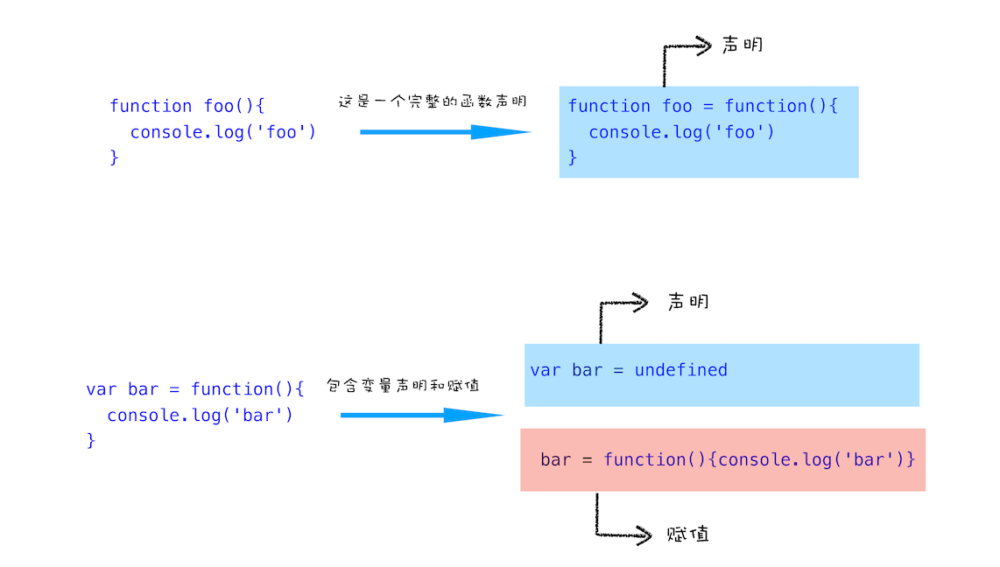

# 变量提升

## 执行上下文

举个栗子：

```js
showName();
console.log(name);
var name = 'Horace';
function showName() {
   console.log('函数 showName 执行!');
}
```

代码执行结果为：

```js
函数 showName 执行!
undefined
```

函数或变量可以在定义之前使用

如果删除第三行的 `var name = 'Horacec';` 的定义部分，JavaScript 引擎会报引用错

- 结论:
  - 执行过程中使用未声明的变量，JavaScript 会报错
  - 在一个变量定义之前（var 定义的变量）使用值会是 undefined
  - 在一个函数定义前使用它，不会报错，可以正确执行

## 变量提升

`var name = 'Horace';`

这句代码可以分成两个部分：**声明和赋值**

```js
var name; // 声明部分
name = 'Horace'; // 赋值部分
```

而函数的声明和赋值：

```js
function foo() {
  console.log('foo');
}

var bar = function() {
  console.log('bar');
}
```

第一个函数 foo 是一个完整的函数声明，没有涉及赋值操作

第二个函数是先声明变量 bar，再把 `function() { console.log('bar'); }` 赋值给了 bar



**变量提升：** 变量提升就是指在 JavaScript 代码执行过程中，引擎把变量的声明部分和函数的声明部分提升到代码开头的行为，变量被提升后会设置一个默认值：undefined

最开始的那段代码经过提升后会变为：

```js
/*
* 变量提升
*/
var name = undefined; // name 变量提升，并且设置默认值 undefined
// 函数 showName 声明提升
function showName() {
  console.log('函数 showName 执行!')
}

/*
* 执行代码部分
*/
showName();
console.log(name);
name = 'Horace';
```

**函数和变量在执行之前都提升到了代码开头**

## JavaScript 代码的执行流程

变量提升就像是把变量和函数的声明移动到代码的最前面，**但是实际上变量和函数声明在代码里的位置是不会改变的，而是在编译阶段被 JavaScript 引擎放入内存中**

一段 JavaScript 代码在执行前需要先进行编译，编译完成后才会进入执行阶段

### 1. 编译阶段

之前的代码可以分成：变量提升部分的代码 和 执行部分的代码

- 变量提升部分的代码

  ```js
  var name = undefined; // name 变量提升，并且设置默认值 undefined
  // 函数 showName 声明提升
  function showName() {
    console.log('函数 showName 执行!')
  }
  ```

- 执行部分的代码

  ```js
  showName();
  console.log(name);
  name = 'Horace';
  ```

  

一段代码经过编译后会生成两部分内容：**执行上下文和可执行代码**

**执行上下文是 JavaScript 执行一段代码时的运行环境**，比如调用一个函数，就会进入这个函数的执行上下文，确定该函数在执行期间用到的 this、变量、对象以及函数等

执行上下文包括变量环境和词法环境，变量环境对象中保存了变量提升的内容，比如函数 showName 和变量 name 都存储在该对象中

变量环境对象生成之后，JavaScript 引擎会把声明以外的代码编译成字节码

### 2. 执行阶段

JavaScript 引擎开始执行可执行代码，按照顺序一行一行地执行

```js
showName();
console.log(name);
name = 'Horace';
```

1. 执行到 showName 函数，JavaScript 引擎会在变量环境对象中查找该函数，变量环境中存在该函数的引用（存储在堆内存中），执行该函数

2. `console.log(name);` JavaScript 引擎去变量环境对象中查找 name 变量，变量环境中存在 name 变量，并且值为 undefined

3. `name = 'Horace';` 把 'Horace' 赋值给 name 变量，赋值后环境变量中的 name 属性变为 'Horace'  

   变量环境：

   ```js
   VariableEnvironment:
     name -> "Horace",
     showName -> function: {console.log('函数 showName 执行!')}
   ```

   

## 代码中出现相同的变量或者函数？

```js
function showName() {
  console.log('Horace');
}
showName();

function showName() {
  console.log('new Horace');
}
showName();
```

输出两个 new Horace

**一段代码如果定义了两个相同名字的函数，那么最终生效的是最后一个函数**

**同名变量和函数的两点处理原则：**

1. 如果是同名的函数，JavaScript 编译阶段会选择最后声明的那个。

2. 如果变量和函数同名，那么在编译阶段，变量的声明会被忽略