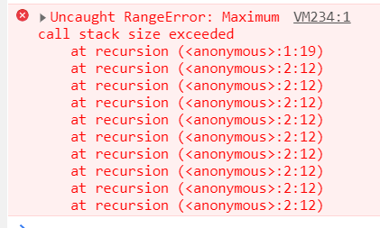
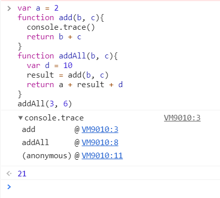

# 调用栈和栈溢出

什么样的代码会在执行前进行编译并创建执行上下文？

1. 当 JavaScript 执行全局代码时，会编译全局代码并创建**全局执行上下文**，在整个页面声明周期内，全局执行上下文只有一份
2. 当调用一个函数时，编译创建**函数执行上下文**，一般函数执行结束后，创建的函数执行上下文会被销毁
3. 当使用 eval 函数欺骗词法的时候，**eval 的代码也会编译并创建执行上下文**

爆栈，也就是栈溢出



栈溢出涉及调用栈，**调用栈就是用来管理函数调用关系的一种数据结构**

## 什么是函数调用

函数调用就是运行一个函数

举个栗子：

```js
var a = 2;
function add() {
  var b = 10;
  return a + b;
}
add();
```

创建了一个 add 函数并调用

函数调用过程：

- 执行到 add() 之前，JavaScript 引擎会先**创建一个全局执行上下文**，包含声明的函数和变量

  

- 执行上下文创建完毕后**开始执行全局代码**，执行到 add() 时，判断为一个函数调用，就会执行以下操作：

  - 从全局上下文中**取出 add 函数代码**
  - 对 add 函数代码进行编译，**创建函数执行上下文和可执行代码**
  - **执行代码，输出结果**

  

执行到 add() 的时候，存在两个执行上下文：全局执行上下文和 add 函数执行上下文，同一时间可能会存在多个执行上下文，**JavaScript 使用栈的数据结构来管理执行上下文**

## 什么是栈

栈是一种先进后出的数据结构，并且只能在栈顶进行相应的操作

就像是单向的单通道的停车场，只有一个出口，堵住之后只能先让后进去的车先出来

## 什么是 JavaScript 的调用栈

在执行上下文创建好后，JavaScript 引擎会将执行上下文压入栈中，**用来管理执行上下文的栈叫做执行上下文栈**，也叫**调用栈**

```js
var a = 2
function add(b, c){
  return b + c
}
function addAll(b, c){
  var d = 10
  result = add(b, c)
  return a + result + d
}
addAll(3, 6)
```

### 调用栈状态变化过程

- 第一步，**创建全局上下文，压入栈底**

  变量 a、函数 add 和 addAll 都保存到了全局上下文的变量环境对象中

- 执行全局代码，a = 2，将全局上下文变量环境中 a 的值设置为 2

- 调用 addAll 函数，**编译创建 addAll 函数的执行上下文**，压入执行上下文栈

  

  进入 addAll 函数代码执行，d = 10，将 addAll 函数执行上下文中的 d 从 undefined 设置为 10

- result = add(b, c)，调用 add 函数，**编译创建 add 函数执行上下文**，压入执行上下文栈

- **add 函数返回的时候，add 函数执行上下文从栈顶弹出**，并将 addAll 函数执行上下文中的 result 的值设置为 add 函数的返回值

  

- **addAll 函数执行完操作返回，addAll 函数的执行上下文从栈顶弹出**，调用栈只剩下全局上下文

**调用栈是 JavaScript 引擎追踪函数执行的一个机制**

当一次有多个函数被调用时，通过调用栈就能够追踪到哪个函数正在被执行以及各函数之间的调用关系

## 开发中调用栈的使用

### 1. 浏览器查看调用栈信息

在开发者工具中找到需要的代码打断点刷新，可以在右边的 call stack 中看到当前调用栈情况


除了通过断点来查看调用栈，还可以使用 `console.trace()` 来输出当前的函数调用关系



### 2. 栈溢出（爆栈）

**调用栈是有大小的，当入栈的执行上下文超过一定数量，JavaScript 引擎就会报错 —— 栈溢出**，尤其是递归函数容易出现栈溢出

避免或解决栈溢出的方法：

1. 把递归调用的形式改造成其他形式
2. 使用加入定时器的方法把当前任务拆分为其他很小任务

