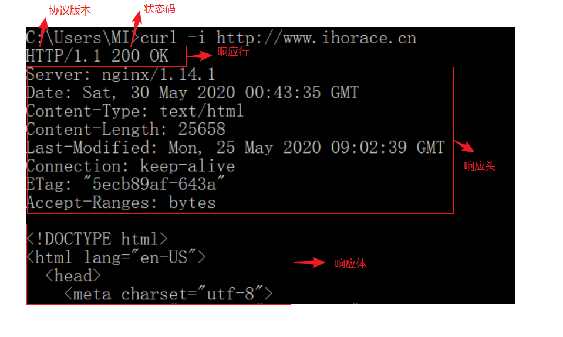
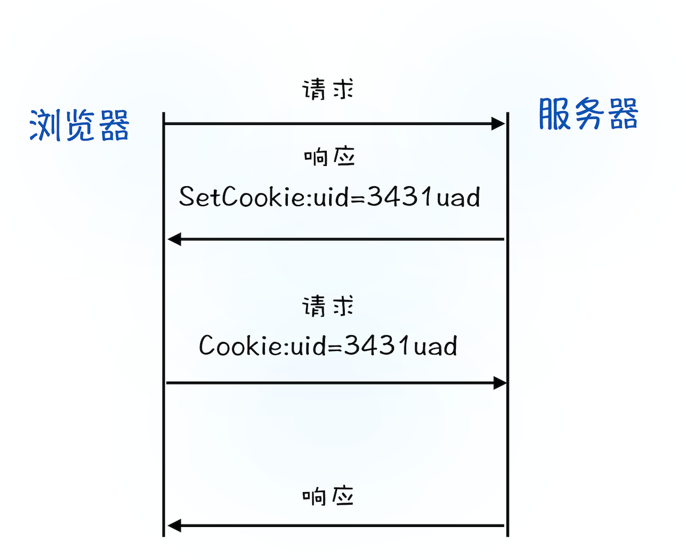

# HTTP 请求流程

HTTP 协议建立在 TCP 连接基础之上

HTTP 是一种允许浏览器向服务器获取资源的协议，是 Web 的基础，通常由浏览器发起请求，用来获取不同类型的文件（HTML、CSS、JS、图片等静态资源）

HTTP 是浏览器使用最广的协议

## TCP 和 HTTP 的关系

浏览器使用 HTTP 协议作为应用层协议，封装请求的文本信息

使用 TCP/IP 协议作传输层协议将它发布到网络上

在 HTTP 开始工作前，浏览器需要通过 TCP 与服务器建立连接

HTTP 的内容是通过 TCP 的传输数据阶段来实现的

- HTTP 网络请求的第一步？

  通过 TCP 三次握手和服务器建立 TCP 连接

- 建立连接需要哪些信息？

  建立连接需要 IP 地址和端口号

  - IP 地址：通过 DNS 域名系统进行域名 -> IP 地址的映射，获取域名对应的 IP
  - 端口号：如果 URL 没有指定端口，使用 HTTP 协议默认端口 80

## 浏览器端发起 HTTP 请求流程

### 1. 构建请求

浏览器构建**请求行**信息，构建好后，浏览器准备发起网络请求

请求行举例：

`GET /index.html HTTP/1.1`

请求行的构成：请求方法 + 请求  URI字段 + HTTP 版本

### 2. 查找缓存

发起真正网络请求前浏览器会现在浏览器缓存中查询是否有要请求的文件

浏览器缓存时一种在本地保存资源副本，以供下次请求时直接使用的技术

如果命中缓存，浏览器会拦截请求，返回资源副本，结束请求，无需下载

- 缓存的好处
  1. 缓解服务器压力，提升性能（减少资源获取时间）
  2. 资源快速加载

### 3. 准备 IP 地址和端口

- IP 地址：通过 **DNS 域名系统**进行域名 -> IP 地址的映射（**有 DNS 缓存，如果命中缓存会直接使用缓存的解析结果，可以减少一次网络请求**），获取域名对应的 IP
- 端口号：如果 URL 没有指定端口，使用 **HTTP 协议默认端口 80**

### 4. 等待 TCP 队列

- Chrome 中同一个域名同时最多只能建立 6 个 TCP 连接，如果同一域名下同时发生 6 个以上的请求，多余的请求就要进入排队等待状态，直到有进行中的请求完成
- 如果当前请求数量小于 6 个，直接建立 TCP 连接

### 5. 建立 TCP 连接

三次握手和服务器建立连接

### 6. 发送 HTTP 请求

POST 请求的数据信息放在请求体发送

请求行命令发送完毕之后要以请求头形式发送其他一些信息，浏览器的一些基础信息，比如浏览器使用的操作系统、浏览器内核、当前请求的域名信息、浏览器端的 Cookie 信息等

## 服务器端处理 HTTP 请求流程

### 1. 返回请求

返回的响应报文格式：响应行 + 响应头 + 空行 + 响应体

1. 响应行

   协议版本 + 状态码

2. 响应头

   包含服务器自身的一些信息，比如服务器生成返回数据的时间、返回的数据类型（JSON、HTML、流媒体等类型），以及服务器要在客户端保存的 Cookie 等信息

3. 响应体

   实际响应内容

### 2. 断开连接

一旦服务器向客户端返回了请求数据，就要关闭 TCP 连接，如果浏览器或服务器在头信息中加入了 `Connection: Keep-Alive` 字段，TCP 连接在发送后依然保持打开状态

持久化连接可以在下次请求时节省三次握手建立连接的时间，提升资源加载速度（比如一个页面中嵌入的图片全部来自同一个站点）

### 3. 重定向

有些网址返回的状态码会指示需要进行重定向操作

## 为什么很多站点第二次打开速度会很快？

主要原因是第一次加载页面过程中，缓存了一些耗时的数据（DNS 缓存和页面资源缓存）

DNS 缓存节省 DNS 查询时间

浏览器缓存可以减少真实网络请求的数量，直接使用本地资源副本响应请求

### 缓存机制

1. 强缓存：浏览器通过响应头中的 Cache-Control 字段来设置是否缓存该资源，Max-age 参数设置缓存过期时长，在缓存未过期时请求该资源，直接返回缓存中的资源
2. 协商缓存：如果强缓存过期，浏览器会继续发起网络请求并在请求头中带上 `If-None-Match: "xxx"` 字段，服务器端拿到后和 `Etag` 的值进行比较判断资源是否更新
   - 如果资源更新，返回最新的资源给浏览器
   - 如果资源未更新，返回 304 状态码，不返回新数据，缓存可以继续使用，刷新浏览器缓存的新鲜度

## 登录状态是如何保持的？

1. 用户数据用户名和密码提交给服务器

2. 服务器收到后验证信息正确性，如果正确就会生成一段表示用户身份的字符串，并写到响应头中的 `Set-Cookie` 字段中返回给浏览器

3. 浏览器接收到响应头后进行解析，遇到 `Set-Cookie` 字段会把字段对应信息保存到本地 Cookie 中

4. 当用户再次访问，浏览器发起 HTTP 请求，但在请求前会先读取本地 Cookie 数据并写入请求头的 `Cookie` 字段中发送给浏览器

5. 服务器收到请求头后会查找 `Cookie` 字段，当找到对应的信息后查询后台，并判断该用户是已登录状态，然后生成含有该用户信息的页面数据发送给浏览器

6. 浏览器接收到该含有当前用户信息的页面数据后，就可以正确展示用户登录的状态信息了

   

简单地说，如果服务器端发送的响应头内有 `Set-Cookie` 的字段，那么浏览器就会将该字段的内容保持到本地。当下次客户端再往该服务器发送请求时，客户端会自动在请求头中加入 `Cookie` 值后再发送出去。服务器端发现客户端发送过来的 `Cookie` 后，会去检查究竟是从哪一个客户端发来的连接请求，然后对比服务器上的记录，最后得到该用户的状态信息。

## 总结

