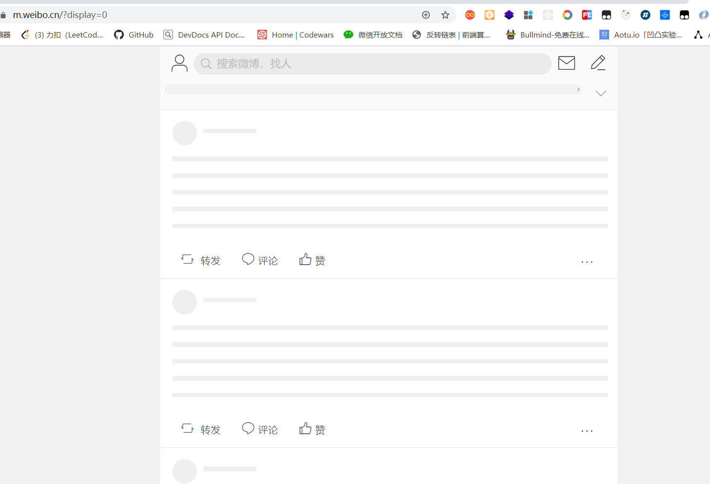

# HTML 的优化

## 精简 HTML 代码结构

- 减少 HTML 的嵌套，减少层级关系
- 减少 DOM 节点数量
- 减少无语义代码 （例如：`

清除浮动`）
- 删除 http 或者 https，如果 URL 的协议头和当前页面的协议头一致，或者此 URL 在多个协议头都是可用的，则可以考虑删除协议头
- 删除多余的空行、换行符、缩进和不必要的注释（可以用压缩工具）
- 省略冗余标签和属性（例如属性值为空未设置）
- 使用相对路径的 URL（相对绝对路径更省字符）

## 文件放置位置

- CSS 文件链接尽量放页面头部
  - **CSS 加载不会阻塞 DOM 树解析，但是会阻塞 DOM 树渲染，也会阻塞后面 JS 执行**
  - 放在 body 元素之前可以确保文档部分中解析了所有的 CSS 样式（内联、外联），从而减少回流次数，若是放在页面底部，就要等待最后一个 CSS 文件下载完成，此时会出现 “白屏” 影响用户体验
- JS 引用放在 HTML 底部
  - 防止 JS 的加载、解析、执行阻塞页面后续元素的渲染

## 增强用户体验

- 设置 favicon.ico

  - 网站如果不设置 avicon.ico，控制台会报错，而且页面加载过程中也没有图标 loading 的过程，同时不利于记忆网站品牌，最好统一添加

  - 增加首屏必要的 CSS 和 JS（在其他资源请求回来的时候先显示）

    如果需要一直等待依赖的 CSS 和 JS 加载完成才显示，则在渲染过程中页面会一直显示空白

    增加首屏必要的 CSS 和 JS，比如页面框架背景图或 loading 图片内联在 HTML 中，可以加快首屏展示速度，相对减少等待（例如新浪微博 M 站页面框架）

在内容完全加载出来之前，用户可以先看到即将展示的内容的样式框架