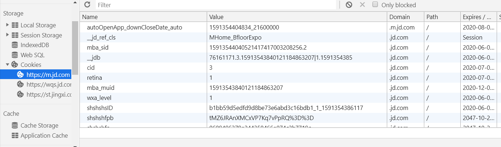
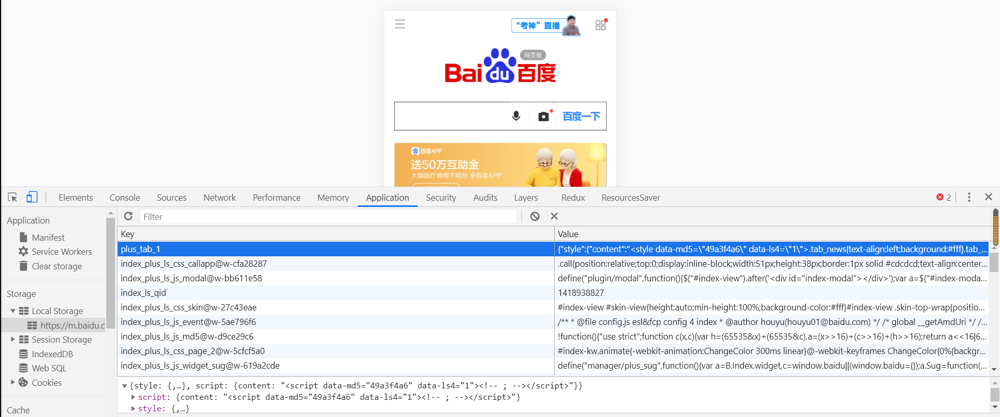

# JavaScript 缓存优化

## Cookie

- 通常由浏览器存储，然后将 Cookie 与后续每个请求一起发送到同一个服务器，收到 HTTP 请求时，服务器可以发送带有 Cookie 的 header 头，可以给 Cookie 设置有效时间

- 应用：

  - 会话登录：登录名，购物车商品，游戏得分或服务器应要记录的其他任何内容

  - 个性化：用户首选项、主题或其他设置

  - 跟踪：记录分析用户行为，比如埋点

  - 举例：m.jd.com => application/session

    

## sessionStorage

- 创建一个本地存储的键值对，有效期为会话级
- 应用：
  - 页面应用页面之间传值

## IndexedDB

- 索引数据库，存储量比较大

- 应用：

  - 客户端存储大量结构化数据
  - 没有网络连接的情况下可以使用（例如石墨文档，断网时的操作信息等存储在 IndexedDB）
  - 将冗余、很少修改但经常访问的数据，以避免随时从服务器获取数据

  

## LocalStorage

- 本地存储，就算关闭浏览器也还是存在，除非手动清空

- 应用：

  - 缓存静态 JS/CSS 文件，再次访问不需要重新加载（例如百度 M 站首页）

    

    如何进行更新：给存储的文件加上特有的后缀（类似于版本号），根据后缀选择需要加载的文件

  - 缓存不经常改变的 API 接口数据（更新周期短的）

  - 储存地理位置信息
  
  - 浏览在页面的具体位置（阅读类网站，类似 keep-alive）