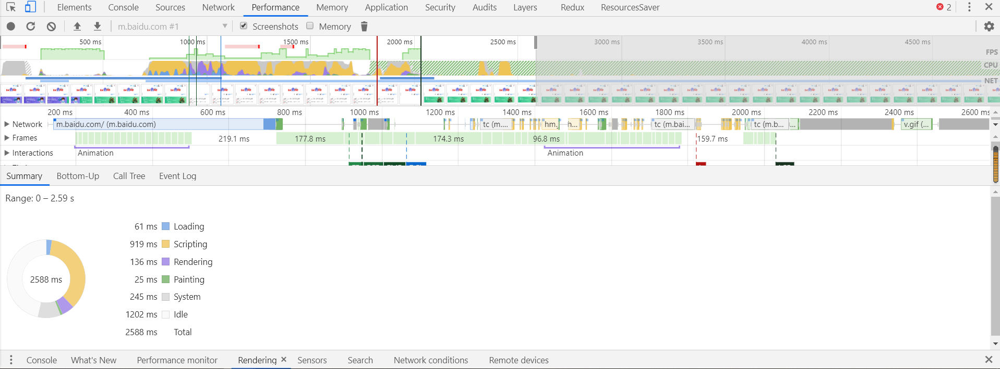

# 减少回流和重绘

## CSS 方面

- 避免过多样式嵌套，让浏览器一次性找到样式
- 避免使用 CSS 表达式（每次 CSS 绘制都会执行）
- 使用绝对定位，让动画元素脱离文档流
- 避免使用 table 布局，table 布局布局完之后会引起浏览器多次重绘
- 尽量不使用 float 布局 => 转为 flex
- 图片最好设置 width 和 height，防止图片尺寸在加载的时候突然变化，固定好大小之后加载完成不会触发回流重绘
- 尽量简化浏览器不必要的任务，减少页面重新布局
- 使用 viewport 设置屏幕缩放级别
- 避免频繁设置样式，最好把新的 style 属性设置完成后，进行一次性更改
- 避免使用引起回流/重绘的属性，最好把相应变量进行缓存
- 利用 CSS3 的`transform`、`opacity`、`filter` 进行 GPU 加速，直接合成

## JS 方面

- 最小化回流和重绘

  - 避免频繁操作 DOM，可以合并多次对 DOM 的修改，然后一次性批量处理

  - DOM 离线操作：当对 `dom` 节点有较大改动的时候，先将元素脱离文档流，然后对元素进行操作，最后再把操作后的元素放回文档流

    - 改变 display 属性，临时将某个元素脱离文档流，然后恢复

      ```js
      var ul = document.getElementById('list');
      ul.style.display = 'none';
      // 对 ul 进行操作
      ul.style.display = 'block'
      ```

    - 使用 createDocumentFragement 创建文档片段，在内存中操作好之后一次性放回页面文档流中

      ```js
      var fragment = document.createDocumentFragment()
      // 在 fragment 上进行一系列操作
      document.getElementById('list').appendChild(fragment)
      ```

    - 通过在需要操作的节点上创建副本，然后在副本上进行操作，最后进行替换

      ```js
      var ul = document.getElementById('list');
      var clone = ul.cloneNode(true);
      // 对 clone 节点进行操作
      ul.parentNode.replaceChild(clone, ul);
      ```

- 控制绘制过程和绘制区域

  - 绘制过程开销比较大的属性设置应该尽量避免减少使用
  - 减少绘制区域范围，对页面的处理控制在指定区域内

